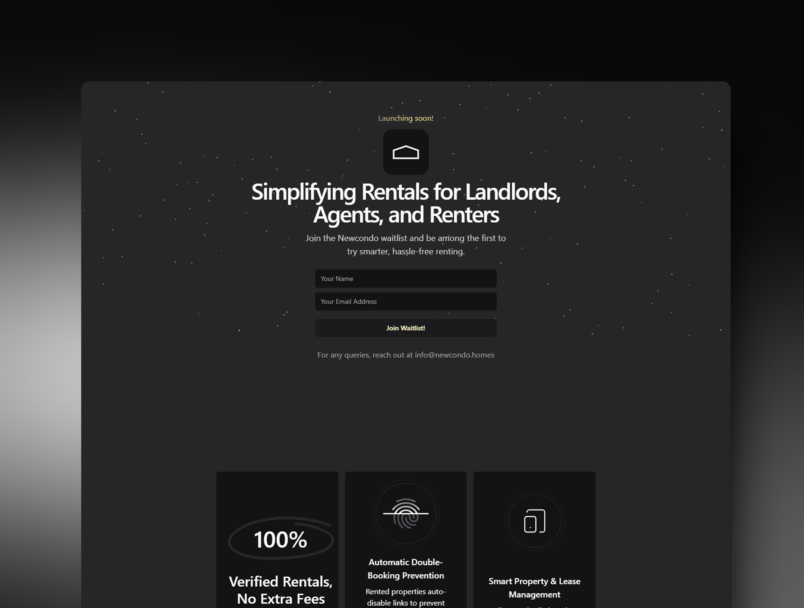

<h1 align="center">NewCondo — Waitlist Landing Page</h1>

<p align="center">
  
  
  
  
  
</p>



This is the waitlist landing page for **NewCondo**, a smarter way to rent, manage, and discover properties. The waitlist captures early interest and sends confirmation emails using Mailgun.

---

## 🚀 Features

- **Next.js 14** – App Router-based fast React framework.
- **Supabase** – Stores waitlist user data.
- **Mailgun** – Sends confirmation emails with your custom domain.
- **shadcn/ui** – Accessible UI components powered by Tailwind CSS.
- **Tailwind CSS** – Utility-first CSS framework for styling.
- **Vercel** – Instant deployment and hosting.

---

## ✨ Why NewCondo?

**Newcondo** is a SaaS platform that empowers landlords, renters, and agents with real-time property management and leasing tools. We’re starting with this waitlist page to collect and onboard early users.

---

## 🧪 Tech Stack

- **Frontend**: Next.js 14, TypeScript, Tailwind CSS, shadcn/ui
- **Backend**: Supabase (PostgreSQL, Row-Level Security)
- **Emailing**: Mailgun API for transactional confirmation emails
- **Deployment**: Vercel

---

## 🔧 Getting Started

Clone the repo and install dependencies:

```bash
git clone https://github.com/YOUR_USERNAME/newcondo-waitlist.git
cd newcondo-waitlist
npm install
